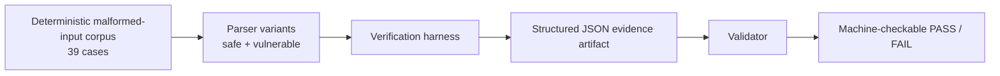

# wedgebench-osff-m1

Deterministic verification workflows and machine-checkable artifacts for embedded firmware behavior under malformed-input conditions.

This repository contains open-source deliverables for the Open Source Firmware Foundation (OSFF) WedgeBench work and demonstrates reproducible verification workflows for parser recovery behavior under malformed inputs.

The focus is not only on issue discovery, but on producing reproducible verification artifacts that preserve observable behavior across deterministic execution conditions.

---

## Project Goal

Most firmware validation workflows focus primarily on pass/fail outcomes under controlled conditions.

WedgeBench explores a complementary model: capturing behavior under malformed-input conditions in a deterministic, reproducible form that can be independently rerun and verified.

The emphasis is on:
- deterministic execution
- explicit failure conditions
- machine-checkable outputs
- validator-backed replay
- independent rerun capability

This project does **not** attempt to provide:
- exhaustive fuzz coverage
- certification
- formal safety proofs

The goal is bounded, reproducible evidence of observable system behavior.

---

## One-Command Run

For the reviewer-facing verification path across M1, M2, and tests, see:

[M1/M2 Reviewer Reproducibility Checklist](docs/M1_M2_Reviewer_Reproducibility_Checklist.md)

```bash
make osff-verify
```

For the M2-specific validator-backed reference integration path:

```bash
make m2-verify
```

For the separate M3 tamper-evident event-log path:

```bash
make m3-verify
```

See the [M3 Event Log Verification Guide](docs/M3_Event_Log_Verification_Guide.md)
for the public schema, verifier behavior, and claim boundary. The fixed files
under `examples/m3/` are illustrative reviewer fixtures, not canonical
execution evidence. M3 does not add signing, trusted timestamps, identity or
provenance attestation, formal proof, or physical-device validation.

### Recommended (Docker — fully reproducible)

```bash
docker compose run --rm sentinel-m1
```

If `docker compose` is unavailable:

```bash
docker build -t wedgebench-osff-m1 .
docker run --rm -v "$(pwd)/evidence:/sentinel/evidence" wedgebench-osff-m1
```

### Native fallback

Requires:
- Python 3.10+
- GCC

```bash
./run_m1.sh
```

All execution paths produce the same schema-valid artifact structure and verification outcome.

---

## Verification Workflow



Execution performs the following steps:

1. Runs deterministic malformed-input corpus
2. Executes parser verification harness
3. Captures observable behavior
4. Produces structured evidence artifact
5. Validates artifact correctness

Expected observable behavior:
- safe parser returns to a functional IDLE state after malformed input handling
- vulnerable parser exhibits reproducible semantic divergence in per-case results
- wedge/crash detection remains separate from semantic correctness checks

---

## Milestone 1 Overview

For a concise reviewer-facing explanation of Milestone 1, see:

[OSFF M1 Verification Overview](docs/OSFF_M1_Verification_Overview.pdf)

---

## Verification Notes for Reviewers

### Firmware Build ID

`firmware_build_id` is populated from:

1. `git describe --exact-match --tags HEAD`
2. `git rev-parse HEAD`
3. `WEDGEBENCH_GIT_SHA`

The submitted artifact is regenerated from the tagged release commit.

---

### Why vuln divergence is measured by correctness, not wedge count

The vulnerable parser demonstrates real semantic defects visible within `per_case_results`.

Example:
- `zero_length_valid_chk`
- safe parser rejects invalid frame
- vulnerable parser incorrectly accepts it

This produces observable behavioral divergence without synthetic injection.

Timing-based wedge detection of the unguarded SOF loop requires impractically large inputs and remains future-scope work.

---

### What `wedge_count=0` means

`wedge_count=0` means the harness did not detect timeout, no-progress, no-heartbeat, or spin behavior for the parser under test. It does not mean the vulnerable parser is semantically correct; semantic defects are measured separately in `per_case_results`.

This is verified using post-reset heartbeat acceptance.

A parser with corrupted internal state after malformed input will fail this verification condition.

---

### Latency Scope

All latency values represent:
- harness-observed roundtrip timing
- Python + ctypes + OS scheduling effects

They do **not** represent device-native execution timing.

---

## Milestone 1 Deliverables

| Deliverable | Location |
|---|---|
| Wedge definition | `docs/wedge_definition.md` |
| M1 overview | `docs/OSFF_M1_Verification_Overview.pdf` |
| Verification harness | `tools/fuzz_runner.py` |
| Schema validator | `tools/validate_evidence.py` |
| Corpus generator | `tools/generate_corpus.py` |
| Reference parser variants | `tools/parser_target.c` |
| Example evidence artifact | `evidence/EP-*-m1.json` |

---

## Repository Structure

```text
wedgebench-osff-m1/
├── docs/
│   ├── wedge_definition.md
│   └── OSFF_M1_Verification_Overview.pdf
├── tools/
│   ├── fuzz_runner.py
│   ├── validate_evidence.py
│   ├── generate_corpus.py
│   └── parser_target.c
├── corpus/
├── evidence/
├── build/
└── run_m1.sh
```

---

## Wedge Definition Summary

A wedge is declared when either:

1. Timeout  
   parser does not complete within `WEDGE_TIMEOUT_MS`

2. No-progress  
   parser `bytes_consumed` counter stalls beyond `PROGRESS_WINDOW_MS`

See `docs/wedge_definition.md` for:
- formal specification
- constants
- category definitions
- gaming resistance assumptions

---

## Corpus Categories

The corpus covers the following malformed-input categories:

| Category | Cases |
|---|---:|
| Valid frames | 4 |
| Partial frames | 7 |
| Overlong length | 3 |
| Bad checksum | 2 |
| Garbage / burst noise | 6 |
| Zero-length payload | 2 |
| Valid structure / garbage payload | 1 |
| SOF mid-frame | 2 |
| Interlaced valid/invalid | 1 |
| Bit flips | 6 |
| Empty input | 1 |
| Single bytes | 4 |

Total: **39 deterministic cases**

---

## Evidence Artifact Format

The harness emits a structured JSON verification artifact.

Example fields:

```json
{
  "schema_version": "1.0.0",
  "firmware_build_id": "<git-sha>",
  "input_corpus_hash": "<sha256>",
  "trial_count": 39,
  "wedge_count": 0,
  "crash_count": 0,
  "latency_distribution": {
    "p50": 6.51,
    "p95": 12.96,
    "p99": 13.65
  }
}
```

Artifacts are:
- deterministic
- machine-checkable
- independently reproducible

---

## Verifying an Evidence Artifact

```bash
python3 tools/validate_evidence.py evidence/EP-20260330-m1.json
```

Validator checks include:
- required schema fields
- type correctness
- percentile ordering
- counter consistency
- per-case aggregation correctness

Exit code:
- `0` = PASS
- `1` = FAIL

---

## M1 Done Condition

Milestone 1 is complete when an independent reviewer can:

1. Check out the tagged release
2. Execute the workflow
3. Produce a schema-valid evidence artifact
4. Validate correctness successfully

The validator script is the machine-readable acceptance check.

---

## Parser Variants

`tools/parser_target.c` contains two parser implementations.

### `parser_safe_*`

Hardened reference implementation:
- bounded loops
- LEN validation
- clean malformed-input rejection
- deterministic reset behavior

### `parser_vuln_*`

Intentionally defective implementation:
- missing iteration guard
- missing LEN upper-bound enforcement
- demonstrates observable divergence behavior

The M1 corpus produces deterministic behavioral differences between the two implementations.

---

## Roadmap

### Milestone 1 — Deterministic Verification Harness

Status: **Complete**

Includes:
- deterministic malformed-input corpus
- parser verification harness
- structured evidence artifacts
- validator-backed replay
- one-command reproducibility

---

### Milestone 2 — Reference Firmware Integration

Status: **Complete**

Current reference integration target:
- `go-tcg-storage`

Includes:
- bounded reference integration against a real firmware-adjacent parser surface
- preservation of deterministic reproducibility
- machine-checkable artifact generation
- validator-backed M2 evidence checks
- publicly reproducible execution workflow

M2 intentionally remains constrained. The goal is to prove portability of the verification workflow into a real firmware-adjacent environment before expanding scope.

---

### Milestone 3 — Verification Logging & Extended Replay

Status: **Release candidate for public review**

Includes:
- verification-oriented event logging
- hash-chain and referenced-artifact verification
- a separate `make m3-verify` acceptance path
- portable illustrative example artifacts

M3 is a bounded tamper-evidence layer. It does not expand the M1 or M2 claim
scope and is not included in `make osff-verify`.

---

## OSFF

Developed in connection with the [Open Source Firmware Foundation](https://opensourcefirmware.foundation/) (OSFF) grant program.

---

## Organization

This work is part of Kaimera Group’s research into reproducible verification workflows and externally verifiable system behavior.

https://kaimeragroup.com

---

## Contact

For collaboration, verification research, or integration discussions:

keith@kaimeragroup.com
